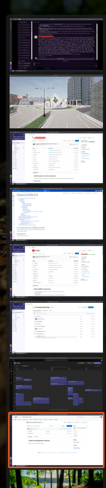

# 🌟 Restore Workspaces Ubuntu
Effortlessly Restore Your Ubuntu Workspace

🚀 Tired of manually setting up your workspaces each time you power on your PC? It used to take me up to 5 minutes every time I started working—what a routine! I searched for solutions, tried several tools, yet none fit my needs.

🤖 We've created a tool that makes recreating your workspaces a breeze!

🎯 With this tool, you can set up scripts for any workspace configuration you desire—let's get started!

# 🛠️ First Step: Set Up Your Workspaces
Initially, manually arrange your workspaces exactly how you want them.



💡 Multiple displays? No problem!

Once you’ve set everything up the way you want...

# 📝 Second Step: Export Your Current Workspace Setup in JSON
## 📋 Requirements
```
sudo apt install wmctrl jq -y
```

## Run the Script
```
chmod a+x ./get_ws.sh
./get_ws.sh
```

🗄️ You should see: `Workspace information saved to workspace_info.json`

Moving on...

# 🔧 Third Step: Adjust the restore_ws.sh Script to Recreate Your Workspaces
This bash script configures your workspaces just the way you need! It opens the desired apps via CLI and places them in the correct workspaces.

The command template is:

`open_and_move app_cmd expected_title workspace_num x_start y_start width height`

🔍 It identifies the application by `expected_title`.

> ⚠️ Note: Workspace numbers should ascend sequentially, starting with 0.

## 🔨 Option One: Adjust Manually
Personalize the script to your needs.

## 🧙‍♂️ Option Two: Use an AI Assistant
Harness AI power for refining your scripts with the prompt:

```
here is the contents of workspace_info.json:
<your JSON contents>
Adjust the next bash script 'open_and_move' commands accordingly to recreate my workspaces.
<THIS BASH SCRIPT code>
```
✨ Adjust manually afterward, as AI may be imperfect—and enjoy your streamlined workspace setup!


# Final Step:
Just run:

```
./restore_ws.sh
```

🎉 YOU'RE ALL SET UP!

# Add it to /usr/bin

```
sudo cp restore_ws.sh /usr/bin/restore_ws
sudo cp get_ws.sh /usr/bin/get_ws
sudo cp close_all_open_windows.sh /usr/bin/close_ws
```

## Run
```
get_ws

restore_ws

close_ws
```