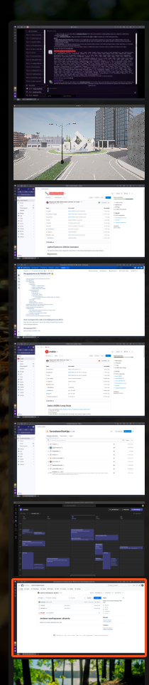

# 🌟 Restore Workspaces Ubuntu
Effortlessly Restore Your Ubuntu Workspace

🚀 Tired of manually setting up your workspaces each time you power on your PC? It used to take me up to 5 minutes every time I started working—what a routine! I searched for solutions, tried several tools, yet none fit my needs.

🤖 We've created a tool that makes recreating your workspaces a breeze!

🎯 With this tool, you can set up scripts for any workspace configuration you desire—let's get started!

# 🛠️ First Step: Set Up Your Workspaces
Initially, manually arrange your workspaces exactly how you want them.



💡 Multiple displays? No problem!

Once you’ve set everything up the way you want...

# 📝 Second Step: Export Your Current Workspace Setup in JSON
## 📋 Requirements
```
sudo apt install wmctrl jq gnome-tweaks  -y
```

## Run the Script
```
chmod a+x ./get_ws.sh
./get_ws.sh
```

🗄️ You should see: `Workspace information saved to workspace_info.json`

Moving on...

# 🔧 Third Step: Adjust the restore scripts to Recreate Your Workspaces
These bash scripts (for example, `restore_ws_work.sh`, `restore_ws_freelance.sh`) configure your workspaces just the way you need! They open the desired apps via CLI and place them in the correct workspaces.

The command template is:

`open_and_move app_cmd expected_title workspace_num x_start y_start width height`

🔍 It identifies the application by `expected_title`.

> ⚠️ Note: Workspace numbers should ascend sequentially, starting with 0.

## 🔨 Option One: Adjust Manually
Open one of the `restore_ws.sh` script and manually write `open_and_move` commands for all windows you want to restore, using `workspace_info.json` as a reference.

After you finish, **run the script and verify** that all windows open and move correctly, and then tweak any commands or titles as needed.

## 🧙‍♂️ Option Two: Use an AI Assistant to Generate `restore_ws.sh`
Use an LLM agent (ChatGPT, Claude, local LLM, etc.) to generate or update a `restore_ws.sh` script directly from `workspace_info.json` with a prompt like:

```
Here is the contents of my workspace_info.json:
<PASTE workspace_info.json HERE>

Write a bash script named restore_ws.sh that:
- sources restore_ws_template.sh (to reuse the open_and_move function and common variables)
- contains open_and_move commands that recreate ALL workspaces and windows from this JSON
- uses appropriate app launch commands (Cursor/VSCode, browser, Obsidian, Steam, etc.)
- passes correct workspace number, x, y, width, height from the JSON
```

After the LLM generates `restore_ws.sh` (or another `restore_ws_<>.sh` you requested):
- **Save it into this repo**
- **Run it manually and verify** that all windows open and move correctly
- **Adjust individual commands/titles by hand if needed** (AI may guess some launch commands or titles incorrectly)

✨ Once it behaves as you like, you’re ready to restore that workspace layout with a single command!


# Final Step:
Just run:

```
./restore_ws.sh
```

🎉 YOU'RE ALL SET UP!

# Add it to /usr/bin

```
sudo cp restore_ws.sh /usr/bin/restore_ws
sudo cp get_ws.sh /usr/bin/get_ws
sudo cp close_all_open_windows.sh /usr/bin/close_ws
```

## Run
```
get_ws

restore_ws

close_ws
```